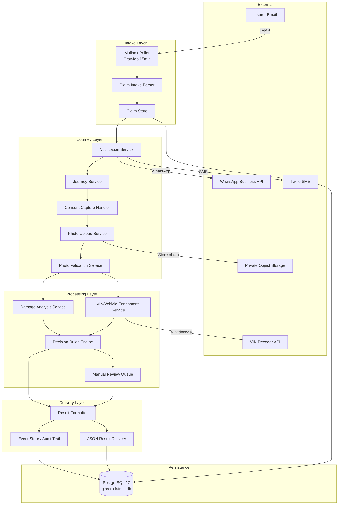
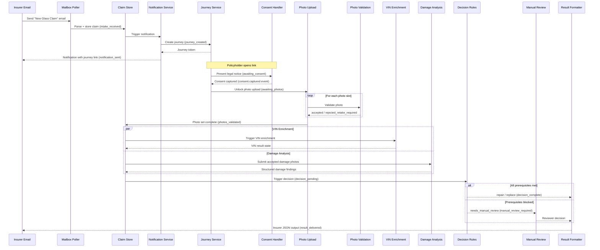
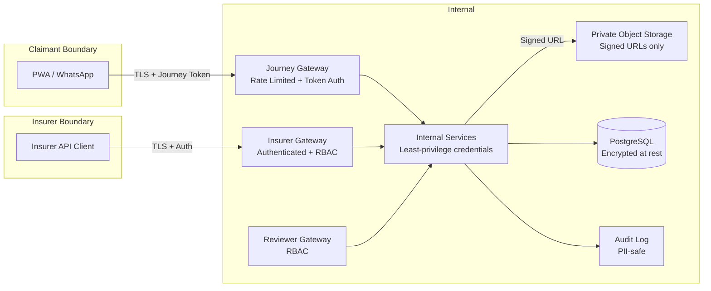

# Design Document: Glass Claim Assessment System — Phase 1 Pilot

## Overview

The Glass Claim Assessment System is a Phase 1 controlled pilot for windscreen-only insurance claims. It is designed for a single-customer-first deployment with risk-averse insurance carriers. The system guides claimants through a consent-gated evidence capture journey, validates photo quality, enriches vehicle data, applies deterministic repair/replace rules, and routes uncertain cases to a first-class manual review workflow.

### Design Principles

1. **Safety over automation** — no final repair/replace decision is emitted unless all prerequisites are verified
2. **Consent as a hard gate** — no photo upload or downstream processing begins without recorded consent
3. **Deterministic rules** — the decision engine is rule-based and produces the same output for the same inputs
4. **Explainability** — every decision includes structured justification and prerequisite check results
5. **Immutable audit trail** — every material lifecycle transition emits a durable, structured event
6. **Dual status model** — external status is always derived from internal status, never stored independently
7. **Hybrid persistence** — relational columns for queryable fields, JSONB for flexible payloads

### Scope

**In scope:** windscreen claims only, email inbox intake, PWA or WhatsApp claimant journey, consent/legal notice, photo upload/validation/retake, VIN enrichment, structured damage analysis, deterministic repair/replace rules, manual review workflow and override tracking, insurer-facing structured JSON output, PostgreSQL persistence, event logging and audit trail, core security controls.

**Out of scope:** non-windscreen glass claims, deep production carrier integration, self-serve insurer admin, white-label branding, full enterprise SSO, advanced fraud detection as primary feature, full multi-tenant productization, model retraining pipeline.

---

## Architecture

### Four-Layer Architecture



### Claim Lifecycle Sequence



### Technology Stack

| Concern | Choice |
|---------|--------|
| Mailbox polling | IMAP client (e.g. `imapflow` for Node.js) |
| Scheduler | `node-cron` or system cron, 15-minute interval |
| Notifications | Twilio SMS + WhatsApp Business API |
| Photo capture | PWA (browser camera API) + WhatsApp media messages |
| Object storage | Private bucket, signed upload/read URLs |
| Database | PostgreSQL 17 (`glass_claims_db`, `glass_user`) |
| VIN decode | External VIN Decoder API |
| Damage analysis | Computer vision model (TensorFlow / PyTorch) |

---

## Components and Interfaces

### 1. Mailbox Poller (CronJob)

Polls the IMAP inbox every 15 minutes for emails with subject "New Glass Claim". Parses key: value body fields, invokes the Claim Intake Parser, moves processed emails to "Completed", and moves unparseable emails to "Failed".

```typescript
interface ClaimEmail {
  messageId: string;       // IMAP message ID — idempotency key component
  subject: string;
  body: string;            // key: value formatted fields
  receivedAt: Date;
  sourceMetadata: Record<string, string>;
}

interface ParsedIntakeFields {
  insurerName: string;
  insurerId: string;
  claimNumber: string;
  policyholderName: string;
  policyholderMobile: string;
  policyholderEmail?: string;
  insurerProvidedVin?: string;
}

// Idempotency key: sha256(messageId + claimNumber)
type IntakeKey = string;
```

**Idempotency:** The poller checks both the "Completed" folder (IMAP) and the persisted `intake_message_id` column before creating a claim. A claim is only created once per unique intake key.

---

### 2. Claim Intake Parser

Validates parsed fields, generates a UUID claim ID, derives the intake key, and writes the initial `claim_inspections` row.

```typescript
interface ClaimCreationResult {
  claimId: string;
  intakeKey: string;
  internalStatus: 'intake_received' | 'intake_failed';
  parseErrors?: string[];
}
```

---

### 3. Notification Service

Resolves the notification channel (SMS or WhatsApp) per insurer config, dispatches the journey link, and records delivery status.

```typescript
interface NotificationRequest {
  claimId: string;
  policyholderMobile: string;
  journeyLink: string;
  channel: 'sms' | 'whatsapp';
}

interface NotificationResult {
  claimId: string;
  channel: 'sms' | 'whatsapp';
  sentAt: Date;
  providerMessageId: string;
  status: 'sent' | 'failed';
}
```

---

### 4. Journey Service

Creates and manages the claimant journey. Issues signed, high-entropy, expiring journey tokens. Enforces consent gate before unlocking photo upload.

```typescript
interface Journey {
  journeyId: string;
  claimId: string;
  token: string;           // Signed JWT, claim-scoped
  channel: 'pwa' | 'whatsapp';
  expiresAt: Date;
  consentCaptured: boolean;
  consentCapturedAt?: Date;
  consentVersion: string;
  legalNoticeVersion: string;
  sessionMetadata: Record<string, string>;
}

interface JourneyTokenPayload {
  claimId: string;
  journeyId: string;
  exp: number;             // Unix timestamp
  jti: string;             // Unique token ID for revocation
}
```

---

### 5. Consent Capture Handler

Presents the legal notice and records explicit consent. Blocks all photo upload until consent is confirmed.

```typescript
interface ConsentRecord {
  claimId: string;
  consentCaptured: boolean;
  consentCapturedAt: Date;
  consentVersion: string;
  legalNoticeVersion: string;
  channel: 'pwa' | 'whatsapp';
  sessionMetadata: Record<string, string>;
}

interface LegalNotice {
  version: string;
  content: {
    dataProcessingDescription: string;
    automatedAnalysisNotice: string;
    manualReviewNotice: string;
    privacyNoticeUrl: string;
    supportContact: string;
  };
}
```

---

### 6. Photo Upload Service

Accepts photo uploads for authenticated journeys. Enforces consent gate. Routes each photo to the Photo Validation Service. Tracks slot completion.

```typescript
type FixedPhotoSlot = 'front_vehicle' | 'vin_cutout' | 'logo_silkscreen' | 'inside_driver' | 'inside_passenger';
type DamagePhotoSlot = 'damage_1' | 'damage_2' | 'damage_3';
type PhotoSlot = FixedPhotoSlot | DamagePhotoSlot;

interface PhotoUploadRequest {
  claimId: string;
  journeyToken: string;
  slot: PhotoSlot;
  file: Buffer;
  mimeType: string;
  fileSizeBytes: number;
}

interface UploadedPhoto {
  photoId: string;
  claimId: string;
  slot: PhotoSlot;
  storageKey: string;      // Private object storage key
  mimeType: string;
  fileSizeBytes: number;
  uploadedAt: Date;
  validationOutcome: PhotoValidationOutcome;
  validationDetails: Record<string, unknown>;
}

type PhotoValidationOutcome =
  | 'accepted'
  | 'accepted_with_warning'
  | 'accepted_low_quality'
  | 'rejected_retake_required';
```

**Photo set completion rule:** all 5 fixed slots accepted AND at least 1 damage photo accepted AND no more than 3 damage photos present.

---

### 7. Photo Validation Service

Runs per-photo checks and assigns a validation outcome. Updates claim-level evidence sufficiency.

```typescript
interface PhotoValidationResult {
  photoId: string;
  slot: PhotoSlot;
  outcome: PhotoValidationOutcome;
  checks: {
    mimeTypeSupported: boolean;
    fileReadable: boolean;
    fileSizeWithinLimit: boolean;
    minimumResolutionMet: boolean;
    sharpnessAcceptable: boolean;
    brightnessAcceptable: boolean;
    likelyCorrectFraming: boolean;
    likelyNotDuplicate: boolean;
  };
  warnings: string[];
}

type EvidenceSufficiency = 'in_progress' | 'sufficient' | 'sufficient_with_warnings' | 'insufficient';
```

---

### 8. VIN/Vehicle Enrichment Service

Decodes VIN via external API, performs OCR on the VIN cutout photo, runs mismatch detection when both sources are available, and performs ADAS lookup.

```typescript
interface VINEnrichmentResult {
  claimId: string;
  vinResultState: 'validated' | 'ocr_only' | 'insurer_only' | 'mismatch' | 'unavailable';
  insurerProvidedVin?: string;
  ocrExtractedVin?: string;
  bestValidatedVin?: string;
  vehicleData?: {
    make: string;
    model: string;
    year: number;
    bodyType: string;
  };
  adasStatus: 'yes' | 'no' | 'unknown';
  mismatchDetected: boolean;
  enrichedAt: Date;
}
```

**Retry logic:** up to 3 retries with exponential backoff (1s, 2s, 4s) for external API calls.

---

### 9. Damage Analysis Service

Consumes all accepted damage photos and returns structured damage findings. No free-form narrative as primary output.

```typescript
interface DamageAnalysisResult {
  claimId: string;
  damagePoints: Array<{
    affectedRegion: string;
    severityAttributes: Record<string, unknown>;
    glassObservations: string[];
  }>;
  overallConfidence: number;       // 0–1
  uncertaintyIndicators: string[];
  insufficiencyFlags: string[];
  evidenceSufficiencyAssessment: EvidenceSufficiency;
  analysedAt: Date;
}
```

---

### 10. Decision Rules Engine

Deterministic rules engine. Checks all prerequisites before emitting repair or replace. Never emits a binary decision when eligibility is blocked.

```typescript
type DecisionOutcome = 'repair' | 'replace' | 'needs_manual_review' | 'insufficient_evidence' | 'unable_to_assess';

interface DecisionPrerequisiteChecks {
  consentCaptured: boolean;
  allFixedPhotosAccepted: boolean;       // all 5 slots
  atLeastOneDamagePhotoAccepted: boolean;
  evidenceNotInsufficient: boolean;
  structuredDamageOutputPresent: boolean;
  noUnresolvedVinConflict: boolean;
  noBlockingOperationalFlags: boolean;
  confidenceThresholdsMet: boolean;
  noMandatoryManualReviewTrigger: boolean;
}

interface DecisionResult {
  claimId: string;
  outcome: DecisionOutcome;
  decisionEligible: boolean;
  prerequisiteChecks: DecisionPrerequisiteChecks;
  blockingReasons: string[];
  justification: string;
  confidenceSummary: Record<string, number>;
  rulesVersion: string;
  generatedAt: Date;
}
```

**Hard safety rule:** if `decisionEligible` is false, `outcome` MUST NOT be `repair` or `replace`.

---

### 11. Manual Review Queue

Manages the queue of claims requiring human review. Exposes reviewer actions and preserves the original machine assessment.

```typescript
interface ManualReviewRecord {
  reviewId: string;
  claimId: string;
  triggerReasons: string[];
  machineAssessmentSnapshot: DecisionResult;  // immutable copy
  queuedAt: Date;
  reviewStartedAt?: Date;
  reviewCompletedAt?: Date;
  reviewerId?: string;
  reviewerAction?: ReviewerAction;
  finalReviewedOutcome?: DecisionOutcome;
  overrideFlag: boolean;
  overrideReasonCode?: string;
  reviewerNotes?: string;
}

type ReviewerAction =
  | 'approve_machine_result'
  | 'override_to_repair'
  | 'override_to_replace'
  | 'request_retake'
  | 'request_additional_damage_photo'
  | 'mark_insufficient_evidence'
  | 'reject_for_processing';
```

---

### 12. Result Formatter and JSON Delivery

Assembles the insurer JSON output, validates it against the schema, and delivers it.

```typescript
interface InsurerJsonOutput {
  schema_version: string;
  claim_id: string;
  claim_number: string;
  external_status: string;
  internal_status: string;
  assessment_outcome: string;
  decision_eligibility: boolean;
  blocking_reasons: string[];
  final_decision: DecisionOutcome;
  final_decision_source: 'automated' | 'manually_reviewed' | 'hybrid';
  justification: string;
  confidence_summary: Record<string, number>;
  prerequisite_checks: DecisionPrerequisiteChecks;
  vin_data: VINEnrichmentResult;
  damage_summary: DamageAnalysisResult;
  manual_review_flag: boolean;
  manual_review_reason_codes: string[];
  generated_at: string;   // ISO 8601
  rules_version: string;
}
```

---

## Data Models

### Database Overview

**Database:** `glass_claims_db` | **User:** `glass_user` | **Engine:** PostgreSQL 17

Six tables implement a hybrid schema: relational columns for queryable/indexed fields, JSONB for flexible payloads.

```
glass_claims_db
├── claim_inspections      — primary claim record (1 row per claim)
├── claim_events           — immutable event log
├── journeys               — journey tokens and consent state
├── uploaded_photos        — per-photo records and validation outcomes
├── manual_reviews         — manual review queue and decisions
└── notification_deliveries — outbound notification tracking
```

### Table: `claim_inspections`

```sql
CREATE TABLE claim_inspections (
    id                    SERIAL PRIMARY KEY,
    customer_id           VARCHAR(100),
    claim_number          VARCHAR(100) NOT NULL,
    insurer_id            VARCHAR(100) NOT NULL,
    external_status       VARCHAR(50)  NOT NULL,
    internal_status       VARCHAR(50)  NOT NULL,
    policyholder_name     VARCHAR(255) NOT NULL,
    policyholder_mobile   VARCHAR(50)  NOT NULL,
    policyholder_email    VARCHAR(255),
    insurer_provided_vin  VARCHAR(17),
    intake_message_id     VARCHAR(255) UNIQUE NOT NULL,
    received_at           TIMESTAMPTZ  NOT NULL,
    consent_captured      BOOLEAN      NOT NULL DEFAULT FALSE,
    decision_eligibility  BOOLEAN,
    assessment_outcome    VARCHAR(50),
    final_decision        VARCHAR(50),
    rules_version         VARCHAR(50),
    output_schema_version VARCHAR(50),
    created_at            TIMESTAMPTZ  NOT NULL DEFAULT NOW(),
    updated_at            TIMESTAMPTZ  NOT NULL DEFAULT NOW(),
    inspection_data       JSONB        NOT NULL DEFAULT '{}'
);

CREATE UNIQUE INDEX idx_ci_claim_number_insurer ON claim_inspections (claim_number, insurer_id);
CREATE INDEX idx_ci_insurer_id       ON claim_inspections (insurer_id);
CREATE INDEX idx_ci_internal_status  ON claim_inspections (internal_status);
CREATE INDEX idx_ci_created_at       ON claim_inspections (created_at);
CREATE INDEX idx_ci_inspection_data  ON claim_inspections USING GIN (inspection_data);
```

### Table: `claim_events`

```sql
CREATE TABLE claim_events (
    id               BIGSERIAL    PRIMARY KEY,
    event_id         UUID         NOT NULL UNIQUE DEFAULT gen_random_uuid(),
    event_type       VARCHAR(100) NOT NULL,
    claim_id         VARCHAR(36)  NOT NULL,
    timestamp        TIMESTAMPTZ  NOT NULL DEFAULT NOW(),
    source_service   VARCHAR(100) NOT NULL,
    actor_type       VARCHAR(50)  NOT NULL,
    actor_id         VARCHAR(100),
    correlation_id   VARCHAR(36),
    idempotency_key  VARCHAR(255) NOT NULL UNIQUE,
    payload          JSONB        NOT NULL DEFAULT '{}'
);

CREATE INDEX idx_ce_claim_id    ON claim_events (claim_id);
CREATE INDEX idx_ce_event_type  ON claim_events (event_type);
CREATE INDEX idx_ce_timestamp   ON claim_events (timestamp);
```

### Table: `journeys`

```sql
CREATE TABLE journeys (
    id                    SERIAL       PRIMARY KEY,
    journey_id            UUID         NOT NULL UNIQUE DEFAULT gen_random_uuid(),
    claim_id              VARCHAR(36)  NOT NULL,
    channel               VARCHAR(20)  NOT NULL,   -- 'pwa' | 'whatsapp'
    token_jti             VARCHAR(255) NOT NULL UNIQUE,
    expires_at            TIMESTAMPTZ  NOT NULL,
    revoked               BOOLEAN      NOT NULL DEFAULT FALSE,
    consent_captured      BOOLEAN      NOT NULL DEFAULT FALSE,
    consent_captured_at   TIMESTAMPTZ,
    consent_version       VARCHAR(50),
    legal_notice_version  VARCHAR(50),
    session_metadata      JSONB        NOT NULL DEFAULT '{}',
    created_at            TIMESTAMPTZ  NOT NULL DEFAULT NOW()
);

CREATE INDEX idx_j_claim_id ON journeys (claim_id);
```

### Table: `uploaded_photos`

```sql
CREATE TABLE uploaded_photos (
    id                  SERIAL       PRIMARY KEY,
    photo_id            UUID         NOT NULL UNIQUE DEFAULT gen_random_uuid(),
    claim_id            VARCHAR(36)  NOT NULL,
    journey_id          UUID         NOT NULL,
    slot                VARCHAR(50)  NOT NULL,   -- e.g. 'front_vehicle', 'damage_1'
    storage_key         VARCHAR(500) NOT NULL,
    mime_type           VARCHAR(100) NOT NULL,
    file_size_bytes     INTEGER      NOT NULL,
    uploaded_at         TIMESTAMPTZ  NOT NULL DEFAULT NOW(),
    validation_outcome  VARCHAR(50)  NOT NULL,
    validation_details  JSONB        NOT NULL DEFAULT '{}'
);

CREATE INDEX idx_up_claim_id ON uploaded_photos (claim_id);
CREATE INDEX idx_up_slot     ON uploaded_photos (claim_id, slot);
```

### Table: `manual_reviews`

```sql
CREATE TABLE manual_reviews (
    id                        SERIAL       PRIMARY KEY,
    review_id                 UUID         NOT NULL UNIQUE DEFAULT gen_random_uuid(),
    claim_id                  VARCHAR(36)  NOT NULL,
    trigger_reasons           TEXT[]       NOT NULL,
    machine_assessment_snapshot JSONB      NOT NULL,   -- immutable copy
    queued_at                 TIMESTAMPTZ  NOT NULL DEFAULT NOW(),
    review_started_at         TIMESTAMPTZ,
    review_completed_at       TIMESTAMPTZ,
    reviewer_id               VARCHAR(100),
    reviewer_action           VARCHAR(50),
    final_reviewed_outcome    VARCHAR(50),
    override_flag             BOOLEAN      NOT NULL DEFAULT FALSE,
    override_reason_code      VARCHAR(100),
    reviewer_notes            TEXT
);

CREATE INDEX idx_mr_claim_id ON manual_reviews (claim_id);
CREATE INDEX idx_mr_queued_at ON manual_reviews (queued_at);
```

### Table: `notification_deliveries`

```sql
CREATE TABLE notification_deliveries (
    id                  SERIAL       PRIMARY KEY,
    claim_id            VARCHAR(36)  NOT NULL,
    channel             VARCHAR(20)  NOT NULL,
    provider_message_id VARCHAR(255),
    sent_at             TIMESTAMPTZ,
    delivered_at        TIMESTAMPTZ,
    opened_at           TIMESTAMPTZ,
    status              VARCHAR(50)  NOT NULL,
    error_details       JSONB
);

CREATE INDEX idx_nd_claim_id ON notification_deliveries (claim_id);
```

### `inspection_data` JSONB Payload Structure

```typescript
interface InspectionData {
  rawIntakePayload: Record<string, string>;   // original parsed email fields
  validationDetails: {
    intakeKey: string;
    parseErrors?: string[];
    validatedAt?: string;
  };
  vinEnrichmentPayload?: VINEnrichmentResult;
  damageAnalysisPayload?: DamageAnalysisResult;
  decisionPrerequisiteChecks?: DecisionPrerequisiteChecks;
  manualReviewMetadataSnapshot?: {
    reviewId: string;
    triggerReasons: string[];
    machineAssessmentSnapshot: DecisionResult;
  };
}
```

> **MongoDB migration note:** The `inspection_data` JSONB maps directly to a MongoDB document body. Supporting tables can be re-modelled as embedded arrays or separate collections. No structural transformation of the payload is required.

---

## Dual Status Model

External status is always derived from internal status. It is never stored independently.

| Internal Status | Derived External Status |
|----------------|------------------------|
| intake_received | Message Sent |
| intake_validated | Message Sent |
| intake_failed | Needs Action |
| journey_created | Message Sent |
| notification_sent | Message Sent |
| notification_opened | Message Opened |
| awaiting_consent | Message Opened |
| awaiting_photos | Photos In Progress |
| validating_photos | Photos In Progress |
| photos_validated | Photos Submitted |
| photos_insufficient | Needs Action |
| vin_enrichment_pending | Under Review |
| vin_enrichment_complete | Under Review |
| damage_analysis_pending | Under Review |
| damage_analysis_complete | Under Review |
| decision_pending | Under Review |
| manual_review_required | Under Review |
| decision_complete | Result Ready |
| result_delivered | Result Ready |
| failed_validation | Needs Action |
| failed_processing | Needs Action |
| abandoned | Abandoned |

---

## Event Model

Every event uses the following envelope:

```typescript
interface EventEnvelope {
  event_id: string;          // UUID
  event_type: string;        // e.g. 'claim.intake_received'
  claim_id: string;
  timestamp: string;         // ISO 8601
  source_service: string;
  actor_type: 'system' | 'claimant' | 'reviewer' | 'insurer';
  actor_id: string | null;
  correlation_id: string;    // UUID linking related events
  idempotency_key: string;   // prevents duplicate event storage
  payload: Record<string, unknown>;
}
```

Required events (in lifecycle order):

```
claim.intake_received       claim.intake_validated      claim.intake_failed
journey.created             notification.sent           notification.delivered
notification.opened         consent.captured            photo.uploaded
photo.validated             photo.rejected              photo.set_completed
photo.set_insufficient      vin.enrichment_started      vin.enrichment_completed
vin.enrichment_failed       damage.analysis_started     damage.analysis_completed
damage.analysis_failed      decision.manual_review_triggered
decision.generated          decision.overridden         result.delivered
claim.abandoned
```

---

## Security Architecture



**Controls summary:**
- TLS for all traffic
- Signed, high-entropy, expiring journey tokens (JWT, claim-scoped, revocable)
- Rate limiting on all journey endpoints
- Private object storage — no public URLs; signed upload and read URLs only
- MIME/extension validation, max upload size, corrupt file rejection
- Authenticated insurer access; reviewer/admin RBAC
- Least-privilege service credentials; secrets outside source code
- Audit logging for all reads and writes to sensitive data
- PII-safe log output
- Encryption in transit and at rest
- Configurable retention policy for photos and claim data

---

## Error Handling

| Failure Scenario | Handling |
|-----------------|---------|
| Email parse failure | Mark intake_failed, store parse errors, emit claim.intake_failed, move to Failed folder |
| Duplicate intake key | Skip silently, do not create duplicate claim |
| Consent not captured | Reject photo upload with 403, return structured error |
| Expired/revoked journey token | Reject with 401 |
| Photo validation failure | Assign rejected_retake_required, request retake, do not advance |
| Evidence insufficient | Block decisioning, set photos_insufficient, surface to claimant |
| VIN mismatch | Set mismatch state, route to manual review |
| VIN enrichment API failure | Retry 3× with exponential backoff (1s, 2s, 4s); on exhaustion set unavailable, route to manual review |
| Damage analysis failure | Emit damage.analysis_failed, route to manual review |
| Decision prerequisites blocked | Emit needs_manual_review or insufficient_evidence; NEVER emit repair/replace |
| Manual review exhausted retries | Route to manual review with trigger reason exhausted_retry |
| Result delivery failure | Retry delivery; preserve decision_complete state; alert operator |

---

## Testing Strategy

### Dual Testing Approach

- **Unit tests** — specific examples, edge cases, error conditions, component interfaces
- **Property-based tests** — universal properties across generated inputs (see Correctness Properties)

### Property-Based Testing Library

Use [fast-check](https://github.com/dubzzz/fast-check) (TypeScript/JavaScript). Minimum 100 iterations per property test.

Tag format for each property test:
```
// Feature: glass-claim-assessment, Property N: <property_text>
```

### Unit Test Focus Areas

- Email parsing: valid bodies, missing fields, malformed values
- Intake key derivation and idempotency
- Consent gate enforcement (upload rejected without consent)
- Photo slot tracking and completion rule
- VIN mismatch detection logic
- Decision prerequisite check evaluation
- Status derivation (internal → external)
- Event envelope construction
- JSON output schema validation

### Integration Test Focus Areas

- End-to-end intake → journey → consent → photos → decision → output
- Manual review queue and override flow
- IMAP polling and folder management
- Notification dispatch (Twilio/WhatsApp mocks)
- PostgreSQL persistence across all 6 tables
- Object storage signed URL generation


---

## Correctness Properties

*A property is a characteristic or behavior that should hold true across all valid executions of a system — essentially, a formal statement about what the system should do. Properties serve as the bridge between human-readable specifications and machine-verifiable correctness guarantees.*

### Property 1: Claim ID Uniqueness

*For any* set of valid parsed claim emails, all generated claim identifiers SHALL be distinct — no two claims may share the same claim ID regardless of input content.

**Validates: Requirements 1.4**

---

### Property 2: Intake Idempotency

*For any* valid claim email, processing it a second time (same intake key already present in storage) SHALL result in exactly one claim record — the claim count SHALL NOT increase on repeated processing.

**Validates: Requirements 1.5, 1.7**

---

### Property 3: Consent Gate Blocks Photo Upload

*For any* claim where `consent_captured` is false, any photo upload attempt for any slot SHALL be rejected — no photo SHALL be stored and no downstream processing SHALL be triggered.

**Validates: Requirements 2.6, 2.7**

---

### Property 4: Photo Set Completion Rule

*For any* combination of photo slot outcomes, the photo set SHALL be marked complete if and only if: all 5 fixed slots have outcome `accepted` (or `accepted_with_warning` / `accepted_low_quality`) AND at least 1 damage photo slot is accepted AND no more than 3 damage photo slots are present. Any other combination SHALL NOT be marked complete.

**Validates: Requirements 3.6**

---

### Property 5: Evidence Sufficiency Derivation

*For any* combination of photo slot validation outcomes, the derived claim-level evidence sufficiency SHALL be deterministic and SHALL correctly map to one of: `in_progress`, `sufficient`, `sufficient_with_warnings`, or `insufficient` — the same slot state always produces the same sufficiency value.

**Validates: Requirements 4.7**

---

### Property 6: Prerequisites Block Repair/Replace

*For any* claim state where at least one decision prerequisite check is false (including but not limited to: consent not captured, not all 5 fixed photos accepted, no damage photo accepted, evidence insufficient, unresolved VIN conflict, confidence threshold not met, mandatory manual review trigger fired), the Decision Rules Engine SHALL NOT emit `repair` or `replace` as the outcome.

**Validates: Requirements 4.8, 8.3, 8.4**

---

### Property 7: Decision Engine Determinism

*For any* fixed set of decision inputs (prerequisite checks, damage analysis result, VIN enrichment result, rules version), running the Decision Rules Engine twice SHALL produce identical outcomes — the engine is a pure function of its inputs.

**Validates: Requirements 8.1**

---

### Property 8: VIN Result State Derivation

*For any* combination of VIN source availability (insurer VIN present/absent, OCR VIN present/absent) and comparison result (match/mismatch), the system SHALL assign exactly one of the five VIN result states: `validated` (both present and match), `ocr_only` (no insurer VIN), `insurer_only` (no OCR result), `mismatch` (both present but differ), `unavailable` (neither present). The derivation SHALL be deterministic for all input combinations.

**Validates: Requirements 6.3, 6.6**

---

### Property 9: Manual Review Preserves Machine Assessment

*For any* claim that undergoes manual review and any reviewer action (including override), the original machine assessment snapshot stored at queue time SHALL remain unchanged and retrievable after the review is completed.

**Validates: Requirements 9.6**

---

### Property 10: Output Contract Completeness and Decision Source

*For any* decided claim, the generated insurer JSON output SHALL contain all required fields (schema_version, claim_id, claim_number, external_status, internal_status, assessment_outcome, decision_eligibility, blocking_reasons, final_decision, final_decision_source, justification, confidence_summary, prerequisite_checks, vin_data, damage_summary, manual_review_flag, manual_review_reason_codes, generated_at, rules_version) and the `final_decision_source` SHALL correctly reflect whether the decision was `automated`, `manually_reviewed`, or `hybrid` based on whether a manual review occurred and whether it resulted in an override.

**Validates: Requirements 12.2, 12.4**

---

### Property 11: State Transition Emits Event

*For any* material claim lifecycle transition, the claim_events table SHALL contain a corresponding event record with the correct event_type and claim_id before the transition is considered complete — no transition may be finalised without its event being persisted.

**Validates: Requirements 11.5**

---

## Insurer JSON Output Contract

Full example of a delivered output:

```json
{
  "schema_version": "1.0.0",
  "claim_id": "550e8400-e29b-41d4-a716-446655440000",
  "claim_number": "CLM-2024-001234",
  "external_status": "Result Ready",
  "internal_status": "result_delivered",
  "assessment_outcome": "damage_analysis_complete",
  "decision_eligibility": true,
  "blocking_reasons": [],
  "final_decision": "repair",
  "final_decision_source": "automated",
  "justification": "Single chip 0.4 inches diameter in non-critical zone. All NAGS repair criteria met. Confidence threshold exceeded.",
  "confidence_summary": {
    "overall": 0.91,
    "damage_classification": 0.93,
    "vin_enrichment": 1.0,
    "evidence_quality": 0.88
  },
  "prerequisite_checks": {
    "consentCaptured": true,
    "allFixedPhotosAccepted": true,
    "atLeastOneDamagePhotoAccepted": true,
    "evidenceNotInsufficient": true,
    "structuredDamageOutputPresent": true,
    "noUnresolvedVinConflict": true,
    "noBlockingOperationalFlags": true,
    "confidenceThresholdsMet": true,
    "noMandatoryManualReviewTrigger": true
  },
  "vin_data": {
    "vinResultState": "validated",
    "bestValidatedVin": "1HGBH41JXMN109186",
    "vehicleData": { "make": "Honda", "model": "Civic", "year": 2021, "bodyType": "Sedan" },
    "adasStatus": "no"
  },
  "damage_summary": {
    "damagePoints": [
      {
        "affectedRegion": "lower_passenger_quadrant",
        "severityAttributes": { "type": "chip", "diameterInches": 0.4 },
        "glassObservations": ["single_impact", "no_crack_propagation"]
      }
    ],
    "overallConfidence": 0.93,
    "uncertaintyIndicators": [],
    "insufficiencyFlags": [],
    "evidenceSufficiencyAssessment": "sufficient"
  },
  "manual_review_flag": false,
  "manual_review_reason_codes": [],
  "generated_at": "2024-01-15T10:32:00Z",
  "rules_version": "1.0.0"
}
```

**Blocked outcome example** (prerequisites not met):

```json
{
  "schema_version": "1.0.0",
  "claim_id": "...",
  "decision_eligibility": false,
  "blocking_reasons": ["vin_mismatch", "confidence_threshold_not_met"],
  "final_decision": "needs_manual_review",
  "final_decision_source": "automated",
  ...
}
```
